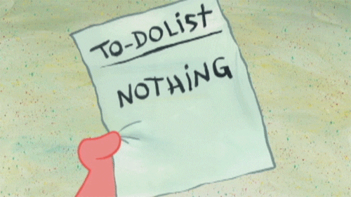

## La Todo List


***
### Préparation
On va commencer par importer le package material, qui va nous permettre d'utiliser un paquet de widgets déjà construits.

```dart
import 'package:flutter/material.dart';
``` 

Le code exécuté en Dart commence toujours par la fonction main(), nous allons donc la créer et éxecuter le component qui contient notre application.
En Flutter tous les components sont appelés "Widgets".

```dart
void main() => runApp(new MyApp());
``` 
***
### Premier Widget
Nous allons créer un Widget stateless qui sera le container de notre app.

```dart
class MyApp extends StatelessWidget {
    @override
    Widget build(BuildContext context) {
        return Container();
    }
}
``` 
Et dedans nous allons utiliser le Widget material "MaterialApp()".
On va pouvoir y mettre le titre de notre app et créer une structure basique avec un titre et un widget qui sera le corps de notre app.

```dart
class MyApp extends StatelessWidget {
    @override
    Widget build(BuildContext context) {
        return new MaterialApp(
          title: 'Todo List',
          home: TodoListScreen(),
        );
    }
}
``` 
***
### Widget Stateful
On va donc créer ce widget stateful qui servira à render la partie de l'écran qui contiendra la todo list

```dart
class TodoListScreen extends StatefulWidget {
  @override
  _TodoListState createState() => _TodoListState();
}

class _TodoListStateScreenState extends State<TodoListScreen> {
  @override
  Widget build(BuildContext context) {
    return Container();
  }
}
``` 

Qui va retourner un widget Scaffold, ce widget sert à créer une structure simple.

On va y intégrer: 
* une appbar
* un body
* unbouton flottant

```dart
class _TodoListStateScreenState extends State<TodoListScreen> {
  @override
  Widget build(BuildContext context) {
    return Scaffold(
      appBar: AppBar(title: Text('Todo List')),
      body: TodoList(
        todos: todos,
        onTodoToggle: _toggleTodo,
      ),
      floatingActionButton: FloatingActionButton(
        child: Icon(Icons.add),
        onPressed: _addTodo,
      ),
    );
  }
}
```

Et créer les fonctions qui serviront dans le Widget.

* La fonction _addTodo() va servir à ajouter des nouvelles tâches et on va empêcher l'utilisateur d'ajouter des tâches vides.

```dart
class _TodoListStateScreenState extends State<TodoListScreen> {

  _addTodo() async {
    final todo = await showDialog<Todo>(
      context: context,
      builder: (BuildContext context) {
        return NewTodoDialog();
      },
    );

    if (todo != null) {
      setState(() {
        todos.add(todo);
      });
    }
  }


  @override
  Widget build(BuildContext context) {
    return Scaffold(
      appBar: AppBar(title: Text('Todo List')),
      body: TodoList(
        todos: todos,
        onTodoToggle: _toggleTodo,
      ),
      floatingActionButton: FloatingActionButton(
        child: Icon(Icons.add),
        onPressed: _addTodo,
      ),
    );
  }
}
```
* La fonction _toggleTodo() va permettre d'afficher si la checkbox est checkée ou pas

```dart
class _TodoListStateScreenState extends State<TodoListScreen> {

  _addTodo() async {
    final todo = await showDialog<Todo>(
      context: context,
      builder: (BuildContext context) {
        return NewTodoDialog();
      },
    );

    if (todo != null) {
      setState(() {
        todos.add(todo);
      });
    }
  }

  _toggleTodo(Todo todo, bool isChecked) {
    setState(() {
      todo.isDone = isChecked;
    });
  }  
```
***
### Boite de dialogue

On va maintenant ajouter un wiget "boite de dialogue" qui est appelée dans _addTodo(). 

```dart
class NewTodoDialog extends StatelessWidget {
  final controller = new TextEditingController();

  @override
  Widget build(BuildContext context) {
    return AlertDialog();
  }
}
```

Et on remplit le widget avec d'autres widget, c'est simple!

```dart
    return AlertDialog(
      title: Text('Nouvelle Tâche'),
      content: TextField(
        controller: controller,
        autofocus: true,
      ),
      actions: <Widget>[
        FlatButton(
          child: Text('Annuler'),
          onPressed: () {
            Navigator.of(context).pop();
          },
        ),
        FlatButton(
          child: Text('Ajouter'),
          onPressed: () {
            final todo = new Todo(title: controller.value.text);
            controller.clear();

            Navigator.of(context).pop(todo);
          },
        ),
      ],
    );
```
***
###  Widget Todolist
On va créer le constructeur d'objet Todo

```dart
class Todo {
  Todo({this.title, this.isDone = false});

  String title;
  bool isDone;
}
```

Et pour finir nous allons créer la class TodoList qui contiendra nos tâches!

```dart
class TodoList extends StatelessWidget {
  TodoList({@required this.todos, this.onTodoToggle});

  final List<Todo> todos;
  final ToggleTodoCallback onTodoToggle;

  Widget _buildItem(BuildContext context, int index) {
    final todo = todos[index];

    return CheckboxListTile(
      value: todo.isDone,
      title: Text(todo.title),
      onChanged: (bool isChecked) {
        onTodoToggle(todo, isChecked);
      },
    );
    
  }

  @override
  Widget build(BuildContext context) {
    return ListView.builder(
      itemBuilder: _buildItem,
      itemCount: todos.length,
      
    );
  }
}
```

Il reste juste une fonction un peu compliquée: la fonction ToggleTodoCallback, qui va servir à render nos tâches avec en paramètres la tâche en question et son état (checkée ou pas)
* [Voici un article pour comprendre Typedef en Dart](https://medium.com/@castellano.mariano/typedef-in-dart-40e96d3941f9)


```dart
typedef ToggleTodoCallback = void Function(Todo, bool);
```

### Suite

#### [Améliorer l'app](./upgrade.md)